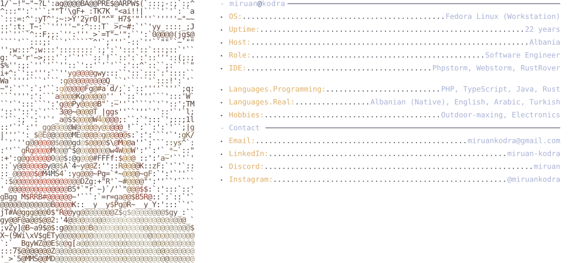
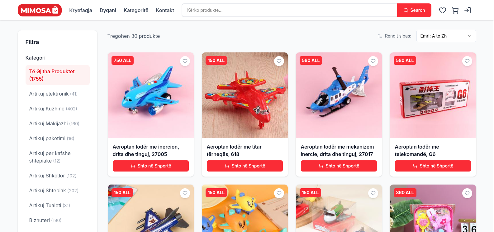

[//]: # (<svg width="1000" height="40" xmlns="http://www.w3.org/2000/svg">)

[//]: # (  <!-- background bar -->)

[//]: # (  <rect width="1000" height="40" rx="8" fill="#1a1b26"/>)

[//]: # ()
[//]: # (  <!-- traffic light buttons -->)

[//]: # (  <circle cx="20" cy="20" r="6" fill="#f7768e"/>)

[//]: # (  <circle cx="42" cy="20" r="6" fill="#e0af68"/>)

[//]: # (  <circle cx="64" cy="20" r="6" fill="#9ece6a"/>)

[//]: # ()
[//]: # (  <!-- centered title -->)

[//]: # (  <text x="500" y="25" text-anchor="middle" font-family="monospace" font-size="14" fill="#c0caf5">)

[//]: # (    miruan@github: ~)

[//]: # (  </text>)

[//]: # (</svg>)

####

<a href="https://github.com/miruankodra">
  <picture>
    <source media="(prefers-color-scheme: dark)" srcset="terminal.svg">
    <source media="(prefers-color-scheme: light)" srcset="terminal-light.svg">
    
  </picture>
</a>

***
### Favourite Tech

[//]: # (### Live products)

[//]: # ()
[//]: # (<table>)

[//]: # (<tr>)

[//]: # (<td width="33%" valign="top">)

[//]: # ()
[//]: # (<a href="https://mimosa.al">)

[//]: # (    )

[//]: # (</a>)

[//]: # ()
[//]: # (**Mimosa Online Shop**)

[//]: # ()
[//]: # ()

[//]: # ()
[//]: # (</td>)

[//]: # (<td width="33%" valign="top">)

[//]: # ()
[//]: # (<a href="https://example.com">)

[//]: # (    )

[//]: # (</a>)

[//]: # ()
[//]: # (**Project 2 name**)

[//]: # ()
[//]: # ()

[//]: # ()
[//]: # (</td>)

[//]: # (<td width="33%" valign="top">)

[//]: # ()
[//]: # (<a href="https://example.com">)

[//]: # (    )

[//]: # (</a>)

[//]: # ()
[//]: # (**Project 3 name**)

[//]: # ()
[//]: # ()

[//]: # ()
[//]: # (</td>)

[//]: # (</tr>)

[//]: # (</table>)

### Selected repos

| Project                                         | Description                                                                                                                                                                      | Tech Stack                                                  |
|-------------------------------------------------|----------------------------------------------------------------------------------------------------------------------------------------------------------------------------------|-------------------------------------------------------------|
| **[Sera](https://github.com/miruankodra/sera)** | Full-stack greenhouse management system: an Angular + Capacitor app for monitoring and controlling a greenhouse in real time, backed by a Laravel REST API and WebSocket server. |  |
                                                                                                                                             |
